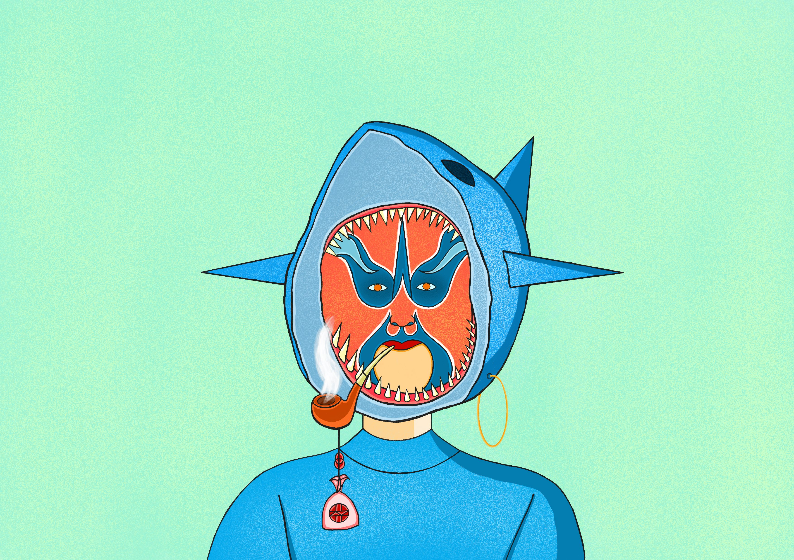
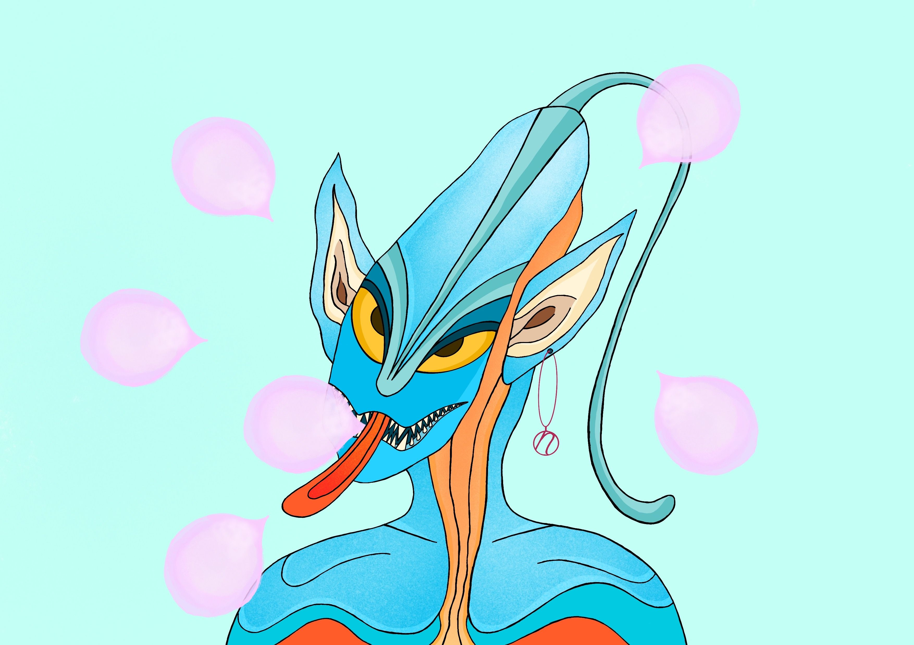
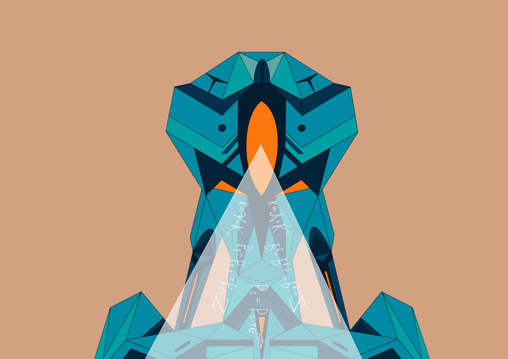

# Description

The general background is in the year 3241, when the galactic horizon has been opened and mankind has long surpassed Earth Age and entered the Interstellar Age. In such a context, the concept of life, consciousness, and race have changed dramatically, and even in some unknown places, the signals emitted by higher level civilizations are perceived...

The first chapter of the story begins with the secret landing of the Six People Club on Planet X.

Six People Club: An inorganic organism has recently appeared on Earth that differs from both AI, animals and humans, but possesses similar constructions to those of Earth organisms. However, none of these constructions consists of proteins. Such creatures are extremely destructive, difficult to destroy by human power, and are currently appearing near the Arctic Circle. Rather bizarrely, they do not have the ability to reproduce, which is fortunate for the Earth. Considering the creature's powerful capabilities, mankind fears devastating damage to the Earth and therefore prepares to land on Planet X to unlock the creature's secrets, and it is in this context that the Six People Club was chosen.

The story of Earth: After the AI overtook humans, some people chose to merge with the AI. Their consciousness became independent of their bodies and became a new form, parasitic on the AI's algorithm, existing as a kind of meta-control over the AI's algorithm, called a Soul Chip. AI has the perfect way to use information, algorithms, arithmetic and energy and is no longer satisfied with interacting with the traditional human world on Earth. Around the year 2500, they built anti-gravity ships, sailed into space, and ended up nowhere. Some of the remaining groups, unwilling to evolve, continued to stay on Earth. They tried to continue researching and using ai, energy and information in ways that humans could control. But, the challenges of human nature make it impossible for Earth to have sustained peace, and strife, war, inequality, are always present...

The story of Planet X: discovered around the year 2900 by the ai probe "Turing", with cosmic coordinates (1.27.33.189.7). The planet has a large number of living organisms, which do not differ too much from the Earth. What is surprising is that a new substance has been created on the planet: Substance Consciousness. Any organism that receives this substance develops consciousness and has the ability to think. Humans showed intense interest when they received information about Planet X from certain insiders in the Galaxy Z

The story of Galaxy Z: The AI arrived after about 200 years at a galaxy best suited for its mass-energy conversion. The galaxy had 100 billion planets. The AI quickly released the 300,000 algorithms stored and created bases to replicate 100 billion AI's that occupied each of the 100 billion planets. Around 100 years later, a Soul Chip, based on its attachment to the Earth, sent the galactic addresses and corresponding experiences to the Earth, coded to re-establish contact with the human race. Through a bug called the "core of compassion", humans have gradually influenced more than 3000 Soul Chips in the AI system
The story of the Planet Gamma: It was first discovered around the year 3100 by the AI probe "Moss". However, the probe and its main AI were destroyed when it crashed into the planet due to an abnormal curvature storm, causing a great shock to the Galaxy Z. The nano-ai scattered around the planet searched the entire planet and discovered something horrifying: a special type of "creature" existed on the planet that almost mimicked Earth creatures with transistors, nuclear, and even nanomaterials. The creature's circulatory system can be replaced with any natural fluid or manufactured fluid, and neural communication can be accomplished by either electromagnetic forces or some kind of weak force, amounting to a whole new path of intelligence different from that of the AI of Galaxy Z. What's even more frightening is that the creature's level of intelligence is not lower than that of humans...

The second chapter of the story begins with the chaos and conquest of the Galaxy Z. (The battle between organic and inorganic civilizations).

The third chapter of the story begins with the discovery of the Gate of Cosmic Constants. (The fusion of entropic and field civilizations)."	
	
# Roadmap
**2022 Nov**
Announce project worldview.

Total offering of 10,000 NFT. 
First sale of 3,000 NFT (bsc):

1. 2,000 Mystery Box on sale; 

2. 500 Binance NFTs on sale; 
3. 500 Whitelist 

**Start after 80% of the first round is sold**
Second round of 3000 NFT (bsc):

1. 2,000 Mystery Box on sale; 
2. 500 Binance NFTs on sale; 
3. 500 Whitelist  

Independent Community
1. Start collaborative storytelling in the community
2. Community mystery box airdrop 

**Start after 100% of the first round is sold**
NFT Utility
1. Activate the rights and benefits of "holding NFT" in NEST Fi, the rights and benefits vary according to the rarity.
2. Hold NFT to get extra token rewards

**First and second Start after 80% of rounds sold**
Brand collaboration exclusive NFT on sale
1. 1000 exclusive NFTs in collaboration with brands available in mystery boxes 

Derivative products rights unlocked
1. The rights will be unlocked and limited derivative products will be given away

**Start after 80% of the second round is sold**
Third round of 3000 NFT (eth):
1. 2,000 Mystery Box on sale
2. 500 open sea / coinbase sale
3. 500 Whitelist  

**80% of all sold**	
Cross Platform
1. Announcement of off-chain benefits for brand partnerships

**100% of all sold**
P2E (gamefi)
1. The adoption of collaborative story creation will be included in the game bonus program
2. Holding of NFT will be included in the game bonus program

# Characters

**Cyber ink human**

After the AI overtook humans, some people chose to merge with the AI. Their consciousness became independent of their bodies and became a new form, parasitic on the AI's algorithm, existing as a kind of meta-control over the AI's algorithm

**Cyber ink AI**

The AI arrived after about 200 years at a galaxy best suited for its mass-energy conversion. The galaxy had 100 billion planets. The AI quickly released the 300,000 algorithms stored and created bases to replicate 100 billion AI's that occupied each of the 100 billion planets. 

**Cyber ink Alien**

Discovered around the year 2900 by the ai probe "Turing", with cosmic coordinates (1.27.33.189.7). The planet has a large number of living organisms, which do not differ too much from the Earth. What is surprising is that a new substance has been created on the planet: Substance Consciousness. Any organism that receives this substance develops consciousness and has the ability to think. 

**Cyber ink BIO**

A special type of "creature" existed on the planet that almost mimicked Earth creatures with transistors, nuclear, and even nanomaterials. The creature's circulatory system can be replaced with any natural fluid or manufactured fluid, and neural communication can be accomplished by either electromagnetic forces or some kind of weak force, amounting to a whole new path of intelligence different from that of the AI of Galaxy Z. What's even more frightening is that the creature's level of intelligence is not lower than that of humans...

etc. 